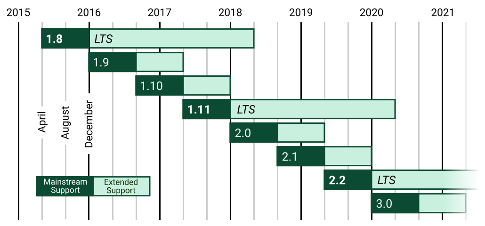
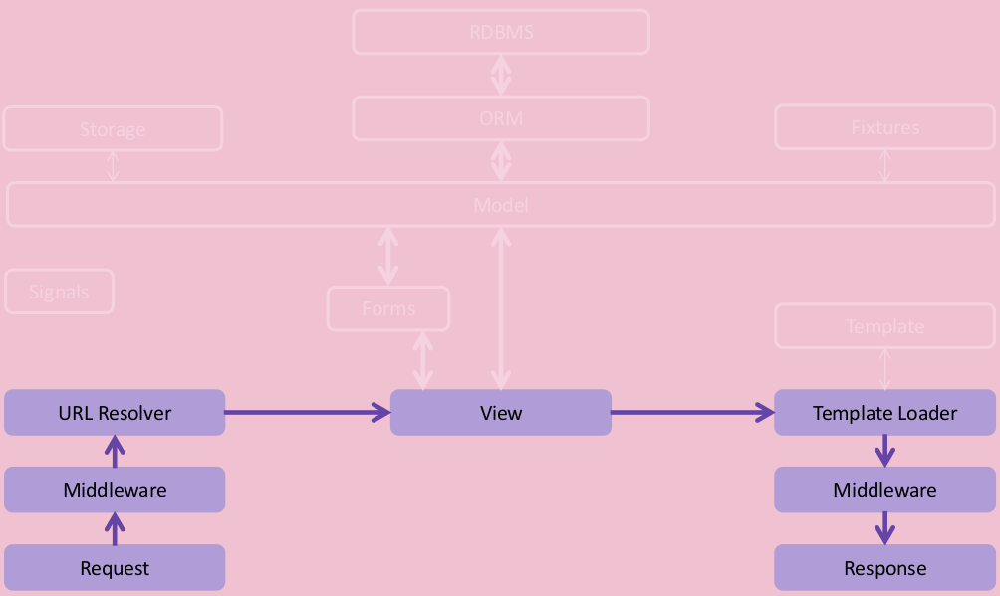
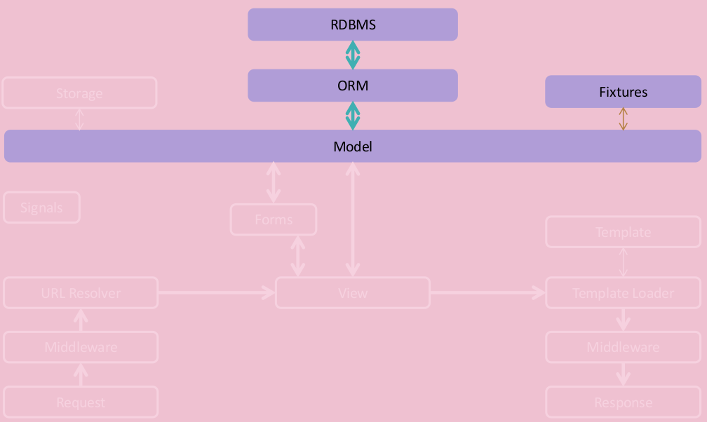
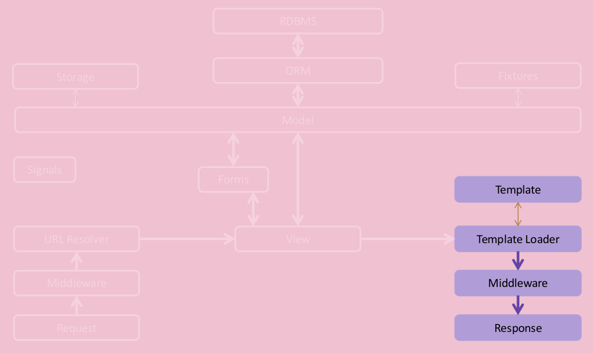

# Django Workshop
## #Bornhack 2016
### Víðir Valberg Guðmundsson `@vvalbergg`
### Benjamin Bach `@benjaoming`
### ...and You!
---

# @vvalbergg

## Works at ShopGun.com
## Been using Django since 2009

---

# @benjaoming

## Works at Learning Equality / Fair Allocation of Infotech Resources
## Been using Django since 2007
## maintains django-wiki, django-money and django-nyt

---

# RTFD

Django Girls tutorial:
http://tutorial.djangogirls.org/en/

Official docs tutorial 1:
https://docs.djangoproject.com/en/1.10/intro/tutorial01/

---

# Program \*) \*\*)

 1. Blah blah theory (~20m)
 1. Enough talk: Example project (~30m)
 1. Your own stuff (>1h)
    1. ...or hack bornhack.dk
    1. ...or challenges for the example project

\*) Remember: It's a crash course

---

\*\*) You don't have to know everything about Django to use Django

---

# Framework ceasefire

||Cool language|App ecosystem|Awesome|
|:-:|:-:|:-:|:-:|
|***Django***|✓|✓|✓|
|***Rails***|✓|✓|✓|
|***Flask***|✓|✓|✓|

---

# What is even Django!?

 - Started at a US Newspaper (Lawrence Journal)
 - Released in 2005
   - 100+ releases, 65 CVE bulletins
   - LTS release cycle introduced
 - Important bullets:
   - Rapid development
   - Reusability and pluggability
   - Don't Repeat Yourself (DRY)
   - Convention over configuration (sane defaults)
   - Batteries included (!=bloat)

---

# Release roadmap



...and it's Python 2+3

---

# Ethos

Django scales.

Pinterest, Instagram, Mozilla, The Washington Times, Disqus, bornhack.dk

---

# Django community

Djangocph, DjangoGirls, DjangoCon US, DjangoCon Europe... and (kind of) ReadTheDocs + Github

---

# Architecture

---

# The framework

 - Views
   - URL dispatcher
 - Models
   - ORM
   - Backends for everything\*
 - Templates
   - Django template language
   - Jinja2
 - Forms
 - Migrations

---

# Terminology

 - Project
 - Application aka. "app"

---

# Architecture: Request->Response (1/3)



---

# Architecture: ORM & Database (2/3)



---

# Architecture: Templates (3/3)



---

# Kind of like this...

	➜  django-admin startproject example_project
    ➜  cd example_project
    ➜  python manage.py runserver 
    Performing system checks...

    System check identified no issues (0 silenced).

    You have 13 unapplied migration(s). Your project may not work properly until you apply the migrations for app(s): admin, auth, contenttypes, sessions.
    Run 'python manage.py migrate' to apply them.

    August 30, 2016 - 12:19:05
    Django version 1.10, using settings 'example_project.settings'
    Starting development server at http://127.0.0.1:8000/
    Quit the server with CONTROL-C.

---

# Request -> Response (views)

`example_project/myapp/views.py`

```python
def my_view(request):
    return HttpResponse("Hello world")
```

`example_project/urls.py`

```python
urlpatterns = [
    url(r'my-view', my_view),
]
```

---

# Models

```python
class MyModel(models.Model):
    field = models.IntegerField(default=42)
```

 - ORM querysets
 - Field types mapped to database
 - Migrations
 - Fat models, skinny views

---

# Templates (1/2)

```python
def my_view(request):
    template = "path/to/template.html"
    context = Context({'object': 'value'})
    return render_to_response(template, context)
```

---

# Templates (2/2)

`project/myapp/templates/path/to/template.html`

```
<html>
  <body>
    <p>Hello world</p>
    <p>{{ object }}</p>
  </body>
</html>
```

---


# Forms (1/2)

```python
class MyForm(forms.Form):
    field = forms.IntegerField()
```

```python
def view(request):
    if request.method == 'POST':
        form = MyForm(request.POST)
        if form.is_valid():
            # do something
            return HttpResponseRedirect("/url")
    else:
        form = MyForm()
    context = Context({'form': form})
    return render_to_response("page.html", context)
```

---

# Forms (2/2)

```html
<html>
  <body>
    <form method="POST">
      {{ csrf_token }}
      {{ form }}
      <button type="submit">Send it</button>
    </form>
  </body>
</html>
```


---

# Migrations

Data models change over time. Full stop.

---

# What is a migration?

Day 1:

```python
class MyModel(models.Model):
    my_field = models.IntegerField()
```

Day 2:

```python
class MyModel(models.Model):
    my_field = models.IntegerField()
    another_field = models.CharField(max_length=123)
```

---

# Handling the schema change

```sh
python manage.py makemigrations
python manage.py migrate
```

---

# Getting ready for hands on!

Everybody got Python?

Everybody got pip?

Okay let's go...


---

# First hands-on: Playbook

GitHub repo:
https://github.com/djangocph/django-bornhack-workshop/

---

# Btw.

Try out the Django shell

```sh
python manage.py shell
``` 

---

# Hack Bornhack.dk

We encourage everyone to fork the site on Github and make PRs.

https://github.com/bornhack/bornhack-website

Quick-start:

    git clone git@github.com:USERNAME/bornhack-website.git
    virtualenv venv
    source venv/bin/activate
    pip install -r requirements/development.txt
    USE_SQLITE=1 make


---

# Sign off

If you like Django, join us in #djangocph (freenode) or AFK:
http://www.meetup.com/The-Copenhagen-Django-Meetup-Group/

Slides and examples on Github:
https://github.com/djangocph/django-bornhack-workshop/